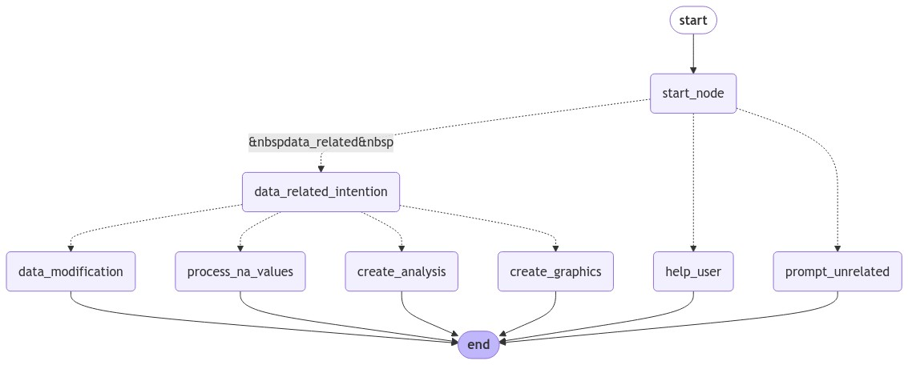

# Chatbot de Análisis de Datos con Llama 3.1 y LangGraph

Este proyecto es un chatbot de análisis de datos que permite a los usuarios interactuar con archivos `.csv` mediante lenguaje natural, eliminando la necesidad de conocimientos técnicos sobre manipulación de datos. El sistema, basado en el modelo Llama 3.1 y una arquitectura de LangGraph, ofrece una interfaz intuitiva y herramientas personalizadas (`tools`) para realizar operaciones complejas de datos de manera sencilla.

## Características Principales

- **Procesamiento de CSV a través de lenguaje natural**: permite realizar operaciones de limpieza, extracción, y transformación de datos sin necesidad de programación.
- **Generación de gráficas**: el chatbot genera visualizaciones de datos, facilitando el análisis y la comprensión de los patrones en los datos.
- **Backend con Lógica de Agente y Tools**: la lógica del chatbot está implementada con LangGraph y cuenta con un conjunto de herramientas personalizadas para manipular y visualizar datos.
- **Despliegue Docker**: el proyecto está estructurado en microservicios independientes para el modelo, el backend y el frontend, y todos se despliegan en contenedores Docker utilizando `docker-compose`.

## Estructura del Proyecto

- **Backend**: Implementado con FastAPI, contiene toda la lógica del agente y la implementación de `tools` que soportan las operaciones del chatbot.
- **Frontend**: Interfaz de usuario diseñada para una interacción intuitiva con el agente, donde el usuario puede cargar archivos `.csv`, visualizar resultados y recibir recomendaciones del chatbot.
- **Modelo Llama 3.1**: Modelo de lenguaje que entiende y responde a comandos en lenguaje natural, entrenado para entender consultas relacionadas con datos.
- **Despliegue en Docker**: Cada componente del proyecto está configurado en un contenedor Docker independiente con su respectivo `Dockerfile`, permitiendo un despliegue ágil y reproducible.

Este proyecto busca simplificar el análisis de datos para usuarios que necesitan realizar consultas y transformaciones de archivos `.csv` de manera eficiente y sin conocimientos técnicos de programación o manipulación de datos.
# Agente de Análisis de Datos Basado en Llama 3.1

Este proyecto es un agente de análisis de datos diseñado para interactuar con el usuario a través de lenguaje natural y realizar modificaciones, análisis, y visualizaciones en archivos de datos. Basado en el modelo Llama 3.1 y en una arquitectura de flujo de estados, este agente permite que los usuarios consulten y manipulen sus datos sin requerir conocimientos técnicos avanzados.

## Arquitectura del Agente

El agente utiliza una arquitectura basada en un grafo de estados (`StateGraph`) para dirigir el flujo de la conversación según las intenciones y necesidades del usuario. Este grafo permite que el agente siga un flujo lógico en cada interacción, ayudándole a identificar la intención principal y guiar las respuestas de manera precisa.

### Proceso de un Prompt a Través del Grafo

1. **Inicio del Grafo**: Todo comienza en el nodo `start_node`, donde el agente evalúa la intención general del prompt del usuario.
2. **Evaluación de Intención**: En el nodo `start_node`, el agente evalúa si la intención del usuario es:
   - Relacionada con datos (`data_related`): Inicia la navegación hacia operaciones sobre los datos.
   - Ayuda al usuario (`help_user`): Si el usuario necesita una guía sobre el agente.
   - No relacionada (`prompt_unrelated`): Si la solicitud no está relacionada con el análisis de datos.
3. **Selección de Operación**: Si la intención es `data_related`, el flujo se divide en diferentes nodos según el tipo de operación solicitada, como `data_modification`, `process_na_values`, `create_analysis`, o `create_graphics`.
4. **Ejecutar la Operación**: Cada nodo correspondiente a una operación dirige el flujo hacia herramientas específicas y genera los resultados en función de los datos y la solicitud del usuario.

## Modelos y Herramientas Especializadas

Debido a la gran variedad de herramientas disponibles, el agente utiliza cinco modelos distintos. Esto permite una mejor gestión y selección de las herramientas para cada tarea específica. Los modelos son los siguientes:

- **Modelo de Modificación de Datos** (`data_modification`): Se utiliza para operaciones de modificación de datos, como filtrar, eliminar columnas, o modificar valores.
- **Modelo para Procesar Valores Faltantes** (`process_na_values`): Este modelo es responsable de manejar valores faltantes mediante imputación o técnicas de reemplazo.
- **Modelo de Análisis de Datos** (`create_analysis`): Realiza análisis estadísticos, cálculos de correlación, y detección de valores atípicos, entre otras tareas.
- **Modelo para Visualización de Datos** (`create_graphics`): Encargado de generar gráficos y representaciones visuales basadas en los datos.
- **Modelo sin Herramientas** (`help_user`): Este modelo es especial porque no incluye herramientas, y se utiliza únicamente para ayudar al usuario. Debido a que Llama 3.1 tiende a forzar el uso de herramientas cuando están disponibles, este modelo se crea específicamente para responder preguntas sobre el agente sin intentar invocar herramientas.

## Ejecución de Herramientas Múltiples en un Solo Prompt

El agente tiene la capacidad de llamar a múltiples herramientas en una sola interacción si es necesario. Esto significa que, a partir de un único prompt del usuario, el modelo puede secuenciar varias herramientas y combinarlas para alcanzar la solución deseada. Esta funcionalidad es particularmente útil en operaciones complejas que requieren varios pasos.

## Instrucciones para Guiar el Comportamiento del Modelo

Cada modelo recibe una instrucción específica que le ayuda a determinar el contexto y seleccionar la herramienta adecuada. Estas instrucciones están diseñadas para guiar al modelo y asegurar que interprete el prompt del usuario de manera precisa, optimizando la experiencia del usuario y la precisión de los resultados.

## Funcionamiento del Grafo de Estados

A continuación se detalla el flujo de estados del agente, representado visualmente en la imagen `graph.png`:
1. El prompt del usuario es evaluado y clasificado en `start_node`.
2. Dependiendo de la intención, el flujo se dirige a:
   - `data_modification`: Para operaciones de modificación de datos.
   - `process_na_values`: Para gestionar valores faltantes.
   - `create_analysis`: Para ejecutar análisis de datos.
   - `create_graphics`: Para crear visualizaciones.
   - `help_user`: Para guiar al usuario.
   - `prompt_unrelated`: Cuando la solicitud no está relacionada con los datos.

Esta estructura garantiza que el agente mantenga un flujo lógico y eficiente en sus interacciones, permitiéndole responder a consultas complejas de manera precisa y ordenada.

---

Este agente representa una solución avanzada para la manipulación y análisis de datos, utilizando una combinación de flujo de estados, múltiples modelos, y un sistema robusto de herramientas que le permiten adaptarse a una amplia variedad de necesidades del usuario.
